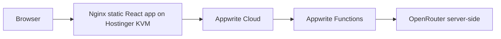

# MSME Pilot Hostinger KVM Deployment

## Overview

This deployment setup serves the MSME Pilot React frontend from a Hostinger KVM VPS using Nginx. Appwrite remains on Appwrite Cloud.

Do not self-host Appwrite in this stage unless you intentionally choose that architecture later.

## Architecture



Vite environment variables are baked into the production build. If Appwrite endpoint, project ID, or function IDs change, update `.env.production`, rebuild, and redeploy.

## Prerequisites

- Hostinger KVM VPS running Ubuntu.
- Domain or subdomain pointed to VPS IP.
- Appwrite Cloud project available.
- Appwrite schema setup completed.
- Appwrite Functions deployed:
  - `parse_invoice_ai`
  - `ai_business_assistant`
- Server-side function env configured in Appwrite Console.
- Security audit reviewed.

## Production Frontend Env

Copy `.env.production.example` to `.env.production` on the VPS or CI:

```env
VITE_APPWRITE_ENDPOINT=https://sgp.cloud.appwrite.io/v1
VITE_APPWRITE_PROJECT_ID=6a4b9c4c001d2015e28a
VITE_APPWRITE_PARSE_INVOICE_FUNCTION_ID=parse_invoice_ai
VITE_APPWRITE_AI_ASSISTANT_FUNCTION_ID=ai_business_assistant
```

Never include API keys in frontend env.

## Appwrite Cloud Production Setup

In Appwrite Console:

- Add Web Platform for `localhost` for local development.
- Add Web Platform for the production domain, for example `msmepilot.in`.
- Add Web Platform for `www.msmepilot.in` or `app.msmepilot.in` if used.
- Use hostnames only. Do not include `https://` unless Appwrite specifically asks.
- Keep OpenRouter and Appwrite server keys only in Appwrite Function environment variables.

Before production, run:

```bash
npm run security:audit
```

Resolve any critical findings before public launch.

## Server Setup

On the Ubuntu VPS:

```bash
bash deployment/scripts/setup-server.sh
```

To enable UFW inside the script:

```bash
ENABLE_UFW=true bash deployment/scripts/setup-server.sh
```

Only enable UFW after confirming SSH access is working.

## Configure Nginx

Copy the Nginx config:

```bash
sudo cp deployment/nginx/msme-pilot.conf /etc/nginx/sites-available/msme-pilot.conf
sudo nano /etc/nginx/sites-available/msme-pilot.conf
```

Replace:

```nginx
server_name your-domain.com www.your-domain.com;
```

Enable the site:

```bash
sudo ln -sfn /etc/nginx/sites-available/msme-pilot.conf /etc/nginx/sites-enabled/msme-pilot.conf
sudo nginx -t
sudo systemctl reload nginx
```

## Build App

From project root:

```bash
npm install
cp .env.production.example .env.production
npm run build
```

Edit `.env.production` before building if your production IDs differ.

## Deploy App

After a successful build:

```bash
bash deployment/scripts/deploy.sh
```

The script:

- Verifies `dist/`.
- Creates a timestamped release in `/var/www/msme-pilot/releases`.
- Updates `/var/www/msme-pilot/current`.
- Tests Nginx.
- Reloads Nginx.
- Keeps the last 5 releases.

## Enable SSL

After DNS points to the VPS and Nginx is serving the site:

```bash
sudo certbot --nginx -d your-domain.com -d www.your-domain.com
```

Certbot will update Nginx for HTTPS.

## Verify Deployment

```bash
bash deployment/scripts/health-check.sh https://your-domain.com
```

Manual checks:

- Landing page loads.
- Login/register work.
- Protected routes work.
- Appwrite CRUD works.
- Invoice OCR and AI functions respond.
- No secrets appear in browser console or network responses.

## Rollback

```bash
bash deployment/scripts/rollback.sh
```

To roll back to a specific release:

```bash
bash deployment/scripts/rollback.sh /var/www/msme-pilot/releases/20260708120000
```

## Optional Docker Frontend

Nginx static deployment is the primary path. Docker is included as an optional alternative:

```bash
docker compose -f docker-compose.frontend.yml up --build -d
```

Vite env values are baked at Docker build time. Use only frontend-safe build args.

## Troubleshooting

- Blank page on nested route: confirm `try_files $uri $uri/ /index.html;`.
- Appwrite auth blocked: add production domain as Appwrite Web Platform.
- AI unavailable: confirm Appwrite Function IDs and server-side function env.
- Build works locally but not server: confirm `.env.production` exists before `npm run build`.
- Security audit bucket issue: Appwrite Free should use the single shared `invoice_images` bucket. Dedicated product/logo/report buckets are optional after upgrade.

## Future Self-Hosted Appwrite Option

See `deployment/SELF_HOST_APPWRITE_LATER.md`. Do not self-host Appwrite on the KVM without a dedicated migration and operations plan.
